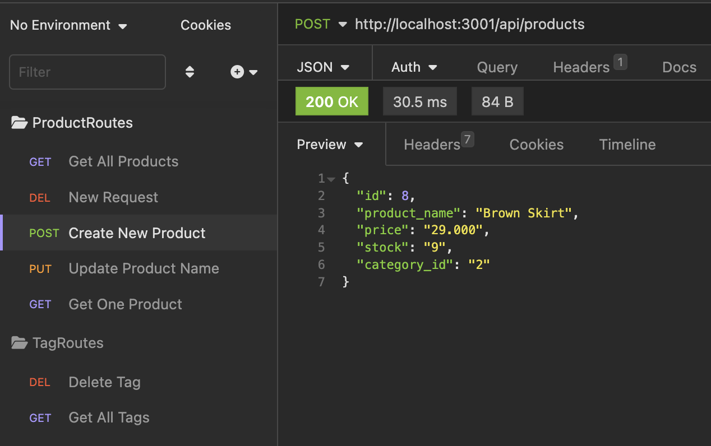
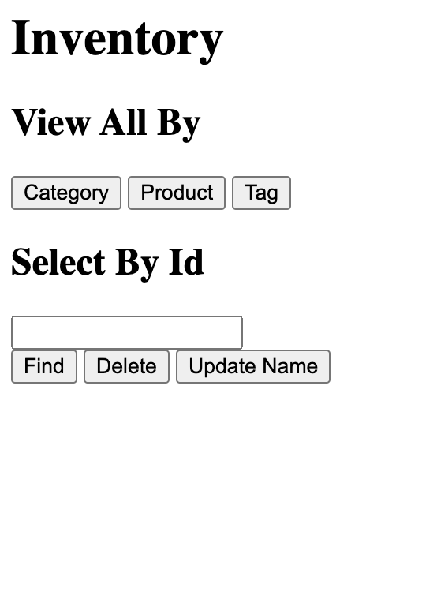
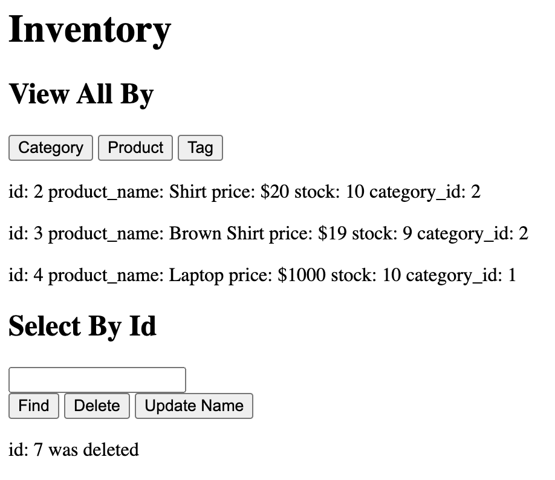

# Basic eCommerce Database

# Express.js API with Sequelize and MySQL

This is a functional Express.js API built using Sequelize as the ORM (Object-Relational Mapping) and MySQL as the database. It provides routes to interact with categories, products, and tags data. The application is linked to basic client side code and API routes can be tested through API tools like Insomnia. 

## Getting Started

To run this application, make sure you have the following dependencies installed:

- Node.js
- npm (Node Package Manager)

To install the required dependencies, run the following command in your terminal:

```bash
npm install dotenv express mysql2 sequelize
```

## Setting Up the Database

Before running the application, you need to set up the database. Follow these steps:

1. Create a `.env` file in the root directory of the project.
2. Add the following variables to the `.env` file:

```
DB_NAME=your_database_name
DB_USER=your_mysql_username
DB_PASSWORD=your_mysql_password
```

Replace `your_database_name`, `your_mysql_username`, and `your_mysql_password` with your actual database credentials.

## Seeding the Database

To create a development database and seed it with test data, run the following commands:

```bash
node db/seeds/seed.js
```

These commands will create the necessary tables, relationships, and populate them with test data.

## Starting the Application

To start the server and sync Sequelize models to the MySQL database, run the following command:

```bash
npm start
```

## Testing the API

You can test the API using tools like [Insomnia Core](https://insomnia.rest/core/). The API provides the following routes:

- `GET /api/categories`: Fetch all categories data.
- `GET /api/products`: Fetch all products data.
- `GET /api/tags`: Fetch all tags data.
- `GET /api/:model/:id`: Fetch data for a specific category, product, or tag by its ID.
- `POST /api/:model`: Create a new category, product, or tag.
- `PUT /api/:model/:id`: Update an existing category, product, or tag by its ID.
- `DELETE /api/:model/:id`: Delete a category, product, or tag by its ID.

## Future Developments

In the future, the application will be enhanced to include a front-end code where users can create input and add user-specific styling. This will allow for a more interactive and user-friendly experience.

## Deployed Appliction 
[Video Walkthrough]()

Example of Insomnia Routes



Example of Front End




## Contributions

Backend code was inspired by [this](https://github.com/coding-boot-camp/fantastic-umbrella) project. 

Please feel free to reach out for any further information or assistance via [email](mailto:merel.burleigh@gmail.com). 
